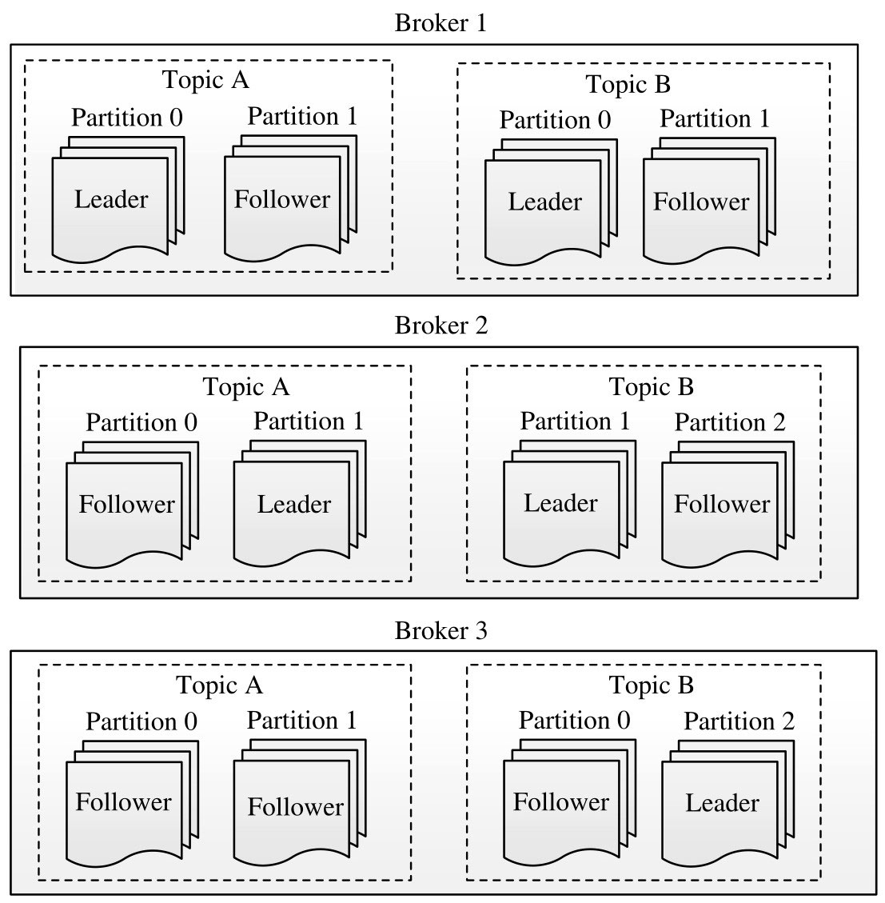

# 大数据技术体系详解：原理、架构与实践

## 第一章 企业级大数据技术体系概述

国务院向社会公布了《促进大数据发展行动刚要》，明确提出大数据的基本概念：**大数据是以容量大、类型多、存储速度快、应用价值高为主要特征的数据集合，正快速发展为对数量巨大、来源分散、格式多样的数据进行采集、存储和关联分析，从中发现新知识、创造新价值、提升新能力的新一代信息技术和服务业态。**

### 1.1 大数据系统产生背景及应用场景

开源系统Hadoop与Spark成为应用最广泛的大数据技术，已经初步成为大数据技术规范。大数据的应用场景按照行业的不同，在电信、医疗、金融、交通等多个领域已经有实际的应用价值。

- 互联网领域：搜索引擎、推荐系统、广告系统。
- 电信领域：网络管理和优化、市场与精准营销、客户关系管理、企业运营管理、数据商业化。
- 医疗领域：临床数据对比、药品研发、临床决策支撑、实时统计分析、基本药物临床应用分析、远程病人数据分析、人口统计学分析、新农合基金数据分析、就诊行为分析、新的服务模式等。
- 金融领域：客户画像应用、精准营销、风险管理、运营优化。

### 1.2 企业级大数据技术框架

从数据在信息系统的生命周期看，大数据从数据源开始，经过分析、挖掘到最终获得价值一般需要经过6个环节，包括数据收集、数据存储、资源管理与服务协调、计算引擎、数据分析和数据可视化，技术体系如下图。


#### 1) 数据收集层

由直接跟数据源对接的模块构成，负责将数据源中的数据接近实时或实时收集到一起。数据源具有如下特点：

- **分布式**：数据分布在不同机器或者设备上。
- **异构性**：数据源多样，可以是Web服务器、数据库、IoT设备等。
- **多样性**：结构化数据和非结构化数据。
- **流式数据**：实时产生。

针对数据源带来的不同挑战，数据收集层往往需要具备的特点有：扩展性、可靠性、安全性、低延迟，同时建议将数据收集到一个中央化的存储系统中。

#### 2) 数据存储层

数据存储层主要负责海量结构化数据与非结构化数据的存储。由于数据收集系统会将各类数据源不断地发到中央化存储系统中，这也对该层的系统提出以下要求：

- **扩展性**：存储系统本身具备非常好的线性扩展能力。
- **容错性**：具备良好的容错机制确保机器故障时不会导致数据丢失。
- **存储模型**：存储层需要支持多种数据结构。

#### 3) 资源管理与服务协调层

传统的平台将不同应用部署到了独立的服务器上，该方案简单易操作，但存在资源利用率低、运维成本高和数据共享困难等问题。为了解决这些问题，避免“**一个应用一个集群**”的部署方式，可以将这些应用部署到一个公共集群中，让他们共享集群资源，并对资源进行统一使用，同时采用轻量级隔离方案对各个应用进行隔离，引入了资源统一管理层，也给客户带来了以下好处：

- **资源利用率高**：共享集群模式通过多种应用共享资源，使得集群中的资源得到充分利用。


- **运维成本低**：少数管理员完成多个框架的一个集群管理。
- **数据共享**：避免了跨集群之间的数据移动，大大减小数据移动带来的成本。

#### 4) 计算引擎层

在实际的生产环境中，存在不同的应用场景，对数据处理的要求也不同。比如在搜索引擎构建索引时，对实时性要求不高，但是要求系统吞吐率高；比如广告系统及信用卡欺诈检测要求对数据进行实时分析，要求每条数据处理延迟尽可能低。**很多人尝试构建一个大统一的系统解决所有类型的计算问题，但最终以失败告终**。系统吞吐率和时延往往是两个相互矛盾的优化方向：吞吐率高时，带来的时延也高，基于此**用一个系统完美解决所有类型的计算任务是不现实的**。

计算引擎发展到今天，已经朝着“小而美”的方向前进，即针对不同应用场景，单独构建一个计算引擎。总体上讲，可以按照对时延性能的要求，将计算引擎分为三类：实时引擎、交互式引擎、批处理引擎。


#### 5) 数据分析层

数据分析层直接跟用户应用程序对接，为其提供易用的数据处理工具，包括应用程序API、类SQL查询语言、数据挖掘SDK等。

在解决实际问题时，可能会结合使用多种工具，典型的使用模式是：首先使用批处理框架对原始海量数据进行分析，产生小规模的数据集，在此基础上，再使用交换式分析处理工具对该数据集进行快速查询，获取最终结果。

#### 6) 数据可视化

数据可视化技术指的是运用计算机图形学和图像处理技术，将数据转换为图形或图像在屏幕上显示出来，并进行交互处理的理论、方法和技术。

### 1.3 企业级大数据技术实现方案

> 真正意义上的大数据技术源于互联网行业，尤其是大数据技术引领者谷歌公司。

Google公开发表的大数据系统方面的论文目前绝大部分都存在对应的开源系统实现。总结近10年Google发表的论文，涉及的大数据系统主要部分在数据存储层、资源管理与服务协调层、计算引擎层、数据分析层这四层中。


#### 1) 数据存储层

**GFS[GGL03]**：Google 文件系统（Google File System）是一个分布式文件系统，具有良好的容错性、扩展性和可用性。

**BigTable[CDG+06]**：构建在GFS之上的分布式数据库本质上是一个稀疏的、分布式的、持久化存储的多维度排序映射表。BigTable支持插入和更新等操作，且行数和列数可以无限扩展，这在很大程度上弥补了传统关系型数据库在schema上的不灵活。

**MegaStore[BBC+11]**：MegaStore是构建在BigTable之上，支持ACID特性的分布式数据库，能够在广域网中同步复制文件写操作，在可接受的延时下，支持跨数据中心的故障迁移。

**Spanner[CDE+13]**：Spanner是一个可扩展的、多版本、全球分布式、支持同步复制的数据库。Google官方认为Spanner是下一代的BigTable，也是MegaStore的继任者。

#### 2) 资源管理与服务协调层

**Borg[VPK+15]**：一个集群资源管理和调度系统，对应用程序进行接收、启动、停止、重启和监控，并且做到跨多个数据中心的资源利用率最大化。

**Omega[SKA+13]**：Google下一代集群资源管理和调度系统，采用了共享状态的架构，使得应用程序调度器拥有整个集群的权限，可以自由获取资源，同时采用了多版本的并发访问控制方式（MVCC，Multi-Version Concurrency Control），解决潜在的资源冲突访问问题。

**Chubby[Bur06]**：该系统旨在为松散耦合的分布式系统提供粗粒度的锁以及可靠存储（低容量的），他提供了一个非常类似于分布式文件系统的接口，能够很容易的实现leader选举、分布式锁、锁命名等分布式问题，它设计的重点在可用性及可靠性而不是高性能。

#### 3) 计算引擎层

**MapReduce[DG08]**：MapReduce是一个批处理计算框架，它采用“分而制之”的思想，将对大规模数据集的操作分解成Map和Reduce两个阶段，Map阶段并行处理输入数据集，产生中间结果，Reduce阶段则通过整合各个节点的中间结果，得到最终结果。简而言之，MapReduce就是**任务的分解与结果的汇总**。

**Dremel[MGL+10]**：Dremel是一个分布式OLAP系统，通过引入列式存储、树状架构等技术，能够帮助数据分析师在秒级处理PB级数据，弥补了MapReduce在交互式查询方面的不足。

**Pregel[MAB+10]**：Pregel是一个分布式图计算框架，专门用来解决网页链接分析、社交数据挖掘等时机应用中涉及的大规模分布式图计算问题，Pregel采用了BSP（Bulk Synchronous Parallel Computing Model）模型，即“计算 - 通信 - 同步”模型，通过消息传递的方式，实现高效的迭代计算。

**Precolator[PD10]**：Percolator是一个基于BigTable构建的大数据集增量更新系统，目标是在海量的数据集上提供增量更新的能力，并通过支持分布式事务来确保增量处理过程的数据一致性和整体系统的可扩展性。

**MillWheel[ABB+13]**：MillWheel是一个分布式流式实时处理框架，它允许用户自定义一些处理单元，并按照一定的拓扑结构连接在一起形成一个有向图，从而形成一个流式处理数据线。

#### 4) 数据分析层

**FlumeJava[CRP+10]**：FlumeJava是一个建立在MapReduce之上的Java编程库，提供了一层高级原语以简化复杂的MapReduce应用程序开发，非常适合构建复杂的数据流水线。

**Tenzing[CLL+11]**：建立在MapReduce之上的SQL查询执行引擎，它可以将用户便携的SQL语句转化为MapReduce程序，并提交到集群中分布式并行执行。

### 1.4 Hadoop与Spark开源大数据技术栈

随着大数据开源技术的跨速发展，目前开源社区应用最广泛的Hadoop与Spark构建了新的生态系统，整个大数据技术栈涉及数据收集、数据存储、资源管理与服务协调、计算引擎和数据分析这五个层级。


#### 1) 数据收集层

> 主要由结构化、非结构化和分布式消息队列构成。

**Sqoop/Canal**：关系型数据收集和导入工具，是连接关系数据库和Hadoop的桥梁，Sqoop可以将关系型数据库中的数据全量导入Hadoop，反之亦可，而Cannal则可以用于实现数据的增量导入。

**Flume**：实时收集流式日志数据，经过滤、聚集后加载到HDFS等存储系统。

**Kafka**：分布式消息队列，一般作为数据总线使用，它允许多个数据消费者订阅并获取感兴趣的数据。

#### 2) 数据存储层

> 主要由分布式文件系统和分布式数据库构成。

**HDFS**：Hadoop分布式文件系统，Google GFS的开源实现，具有良好的扩展性与容错机制设计，非常适合构建在廉价机器上，大大降低了数据存储成本。目前开源社区已经开发了多种类型的数据存储格式，包括SSTable、文本文件、二进制Key/Value格式Sequence File、列式存储格式Parquet、ORC和Carbondata等。

**HBase**：构建在HDFS之上的分布式数据库，Google BigTable的开源实现，允许用户存储结构化和半结构化的数据，支持行列无线扩展以及数据随机查找与删除。

**Kudu**：分布式列式存储数据库，允许用户存储结构化数据，支持行无线扩展以及数据随机查找与更新。

#### 3) 资源管理与服务调度

**YARN**：能够管理集群中的各种资源（CPU和RAM等），并按照一定的策略分配给上层的各类应用。

**ZooKeeper**：基于简化的Paxos协议实现的服务协调系统，它提供了类似于文件系统的数据模型，允许用户通过简单的API实现leader选举、服务命名、分布式队列与分布式锁等复杂的分布式通用模块。

#### 4) 计算引擎层

> 包含批处理、交互式处理和流式实时处理三种引擎。

**MapReduce/Tez**：经典的批处理计算引擎，它是Google MapReduce的开源实现，允许用户通过简单的API便携分布式程序；Tez是基于MapReduce开发的通用DAG（Directed Acyclic Graph，有向无环图）计算引擎，能够更加高效低实现复杂的数据处理逻辑，目前被应用在Hive、Pig等数据分析系统中。

**Spark**：通用的DAG计算引擎，它提供了基于RDD（Resilient Distributed Dataset）的数据抽象表示，允许用户充分利用内存进行快速的数据挖掘和分析。

**Impala/Presto**：分别由Cloudera和Facebook开源的MPP（Massive Parallel Processing）系统，允许用户使用标准SQL处理存储在Hadoop中的数据。

**Storm/Spark Streaming**：分布式流式实时计算引擎，能够高效地处理流式数据，它允许用户通过简单的API完成实时应用程序的开发工作。

#### 5) 数据分析层

> 为方便用户解决大数据问题而提供的各种数据分析工具。

**Hive/Pig/SparkSQL**：在计算引起之上构建的支持SQL或脚本语言的分析系统，大大降低了用户进行大数据分析的门槛。其中，Hive是基于MapReduce/Tez实现的SQL引擎，Pig是基于MapReduce/Tez实现的工作流引擎，Spark-SQL是基于Spark实现的SQL引擎。

**Mahout/MLlib**：在计算引擎之上构建的机器学习库实现了常用的机器学习和数据挖掘算法。

**Apache Beam/Cascading**：基于各类计算框架而封装的高级API，方便用户构建复杂的数据流水线。Apache Beam统一了批处理和流处理两类计算框架；Cascading内置了查询计划优化器，能够自动优化用户实现的数据流。

### 1.5 大数据架构：Lambda Architecture

Lambda Architecture（LA）最早是Twitter工程师Nathan Marz提出来的，他是一种大数据软件设计架构，其目的是知道用户充分利用批处理和流式计算基数各自的有点实现一个复杂的大数据处理系统。LA可以在延迟、吞吐量和容错之间找到平衡点。LA主要思想是将数据处理流程分解成三层：批处理、流处理层和服务层。


**批处理层**：以批为单位处理数据，产生一个经预计算产生的只读数据视图。其优点是吞吐率高，缺点是数据处理延迟高，通常是分钟或小时级别。

**流式处理层**：为了降低批处理带来的高延迟，引入流式处理层，大大降低了数据处理延迟，缺点是无法进行复杂的逻辑计算，得到的往往是近似解。

**服务层**：批处理层和流式处理层可以结合在一起，这样既保证数据延迟低，也能完成复杂的逻辑计算。

--- 

> 后续的内容为大数据技术架构中的单个技术框架详解，非研发体系视兴趣学习。

---

## 第四章 分布式消息队列Kafka

在实际应用中，不同服务器（数据生产者）产生的日志，比如指标监控数据、用户搜索日志、用户点击日志等，需要同时传送到多个系统中以便进行相应的逻辑处理和挖掘，比如指标监控数据可能被同时写入Hadoop和Storm集群（数据消费者）进行离线和实时分析。

消息队列是位于生产者和消费者之间的“中间件”，它解除了生产者和消费者的直接依赖关系，使得软件架构更加容易伸缩和扩展；它能够缓冲生产者产生的数据，防止消费者无法及时处理生产者产生的数据。

### 4.1 Kafka设计动机

每个公司的业务复杂度及生产的数据量都是在不断增加的，如果前端业务和后端存储系统耦合在一起，随着业务的复杂、数据量的增长，会导致各个系统的数据都需要接入到后端存储和分析系统，如图所示。


这种架构存在了以下多个弊端：

- 数据生产者和消费者耦合度过高
- 生产者和消费者数据处理速率不对等
- 大量病发的网络连接对后端消费者不够友好

为了解决以上这些问题，需要引入一层“中间件”，这正是Kafka担任的角色。


**消息中间件**：解耦生产者和消费者，双方互不影响。

**消息队列**：缓存生产者产生的数据，使得消费者可以重复肖霏历史数据；平滑生产者产生数据速度和消费者处理数据速度的不对等。

> *__Kafka与AMQP的关系__：尽管Kafka可以看做一个消息队列，但与ZeroMQ、RabbitMQ等消息队列不同，它不遵循AMQP（Advanced Message Quening Protocol）协议标准，而是在大数据下设计的，有自己的的特色和优势。*

**发布订阅系统**：消费者可订阅某类主题的数据，消费者可快速获取新增数据；可随时增加新的消费者而无需进行任何系统层面的修改。

**消息总线**：所有收集到的数据会流经Kafka，经过Kafka分流后，进入各个消费者系统。

### 4.2 Kafka设计架构

Kafka是一个分布式消息队列，它将数据分区保存，并将粉各分区保存成多份以提高数据可靠性。

#### 1) Kafka基本架构

Kafka架构由Producer、Broker和Consumer三类组件构成，其中Producer将数据写入Broker, Consumer则从Broker上读取数据进行处理，而Broker构成了连接Producer和Consumer的“缓冲区”。Broker和Consumer通过ZooKeeper做协调和服务发现[插图]。多个Broker构成一个可靠的分布式消息存储系统，避免数据丢失。Broker中的消息被划分成若干个topic，同属一个topic的所有数据按照某种策略被分成多个partition，以实现负载分摊和数据并行处理。


Kafka采用了不同于其他消息队列的push-push架构，而是采用了push-pull架构，即Producer将数据直接“push”给Broker，而Consumer从Broker端“pull”数据，这种架构优势主要体现在以下两点：

- Consumer可根据自己的实际负载和需求获取数据，避免采用“push”方式给Consumer带来较大压力。
- Consumer自己维护已读取消息的offset而不是由Broker端维护，这大大缓解了Broker的压力，使得它更加轻量级。


#### 2) Kafka各组件详解

- Kafka Producer

Kafka Producer是由用户使用Kafka提供的SDK开发的，Producer将数据转化成“消息”，并通过网络发送给Broker。
在Kafka中，每条数据被称为“消息”，每条消息表示为一个三元组：

```
<topic, key, message>
```

**topic**：表示该消息所属的topic，一个topic可以分不到多个不同的broker上。

**key**：表示该消息的主键，Kafka会根据主键将同一个topic下的消息划分成不同的分区（partition）。比如当创建topic时指定了分区为4。


**message**：表示该消息的值。

- Kafka Broker

在Kafka中，Broker一般有多个，它们组成一个分布式高容错的集群。Broker的主要职责是接受Producer和Consumer的请求，并把消息持久化到本地磁盘。如图所示，Broker以topic为单位将消息分成不同的分区（partition），每个分区可以有多个副本，通过数据冗余的方式实现容错。当partition存在多个副本时，其中有一个是leader，对外提供读写请求，其他均是follower，不对外提供读写服务，只是同步leader中的数据，并在leader出现问题时，通过选举算法将其中的某一个提升为leader。



Kafka Broker能够保证同一topic下同一partition内部的消息是有序的，但无法保证partition之间的消息全局有序，这意味着一个Consumer读取某个topic下（多个分区中，如图4-6所示）的消息时，可能得到跟写入顺序不一致的消息序列。但在实际应用中，合理利用分区内部有序这一特征即可完成时序相关的需求。


Kafka Broker以追加的方式将消息写到磁盘文件中，且每个分区中的消息被赋予了唯一整数标识，称之为“offset”（偏移量），如上图所示，Broker仅提供基于offset的读取方式，不会维护各个Consumer当前已消费消息的offset值，而是由Consumer各自维护当前读取的进度。Consumer读取数据时告诉Broker请求消息的起始offset值，Broker将之后的消息流式发送过去。

- Kafka Consumer

Kafka Consumer主动从Kafka Broker拉取消息进行处理。每个Kafka Consumer自己维护最后一个已读取消息的offset，并在下次请求从这个offset开始的消息，这一点不同于ZeroMQ、RabbitMQ等其他消息队列，这种基于pull的机制大大降低了Broker的压力，使得Kafka Broker的吞吐率很高。

如下图所示，Kafka允许多个Consumer构成一个Consumer Group，共同读取同一topic中的数据，提高数据读取效率。Kafka可自动为同一Group中的Consumer分摊负载，从而实现消息的并发读取，并在某个Consumer发生故障时，自动将它处理的partition转移给同Group中其他Consumer处理。


- ZooKeeper

在一个Kafka集群中，ZooKeeper担任分布式服务协调的作用，Broker和Consumer直接依赖于ZooKeeper才能正常工作：
- Broker与ZooKeeper：所有Broker会向ZooKeeper注册，将自己的位置、健康状态、维护的topic、partition等信息写入ZooKeeper，以便于其他Consumer可以发现和获取这些数据，当一个Consumer宕掉后，其他Consumer会通过ZooKeeper发现这一故障，并自动分摊该Consumer的负载，进而触发相应的容错机制。
- Consumer与ZooKeeper:Consumer Group通过ZooKeeper保证内部各个Consumer的负载均衡，并在某个Consumer或Broker出现故障时，重新分摊负载；Consumer（仅限于high-level API，如果是low-level API，用户需自己保存和恢复offset）会将最近所获取消息的offset写入ZooKeeper，以便出现故障重启后，能够接着故障前的断点继续读取数据。

---

2020年07月05日，上海，第一稿：完成技术架构 + 消息队列Kafka